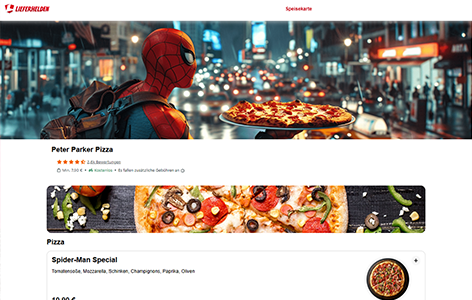

# 🍽️ Lieferheld

Ein kleines Webprojekt zur Simulation eines Essensbestellvorgangs – inspiriert von Plattformen wie Lieferando.

## 🔧 Features

- ✅ Auswahl klickbarer Gerichte
- 🛒 Warenkorb mit Preisberechnung in Echtzeit
- 💸 Bezahl-Simulation mit Bestellbestätigung
- 📦 Datenstruktur in JavaScript (`data.js`)
- 💻 Nur mit HTML, CSS & Vanilla JS umgesetzt (ohne Frameworks)

## 🧠 Lerneffekt

Mein erstes Projekt mit DOM-Manipulation, Eventhandling und dynamischer Preislogik – ein wichtiger Schritt auf meinem Weg in die Webentwicklung.

## 📁 Projektstruktur

- `index.html` – Hauptlayout und Struktur
- `style.css` – Gestaltung
- `script.js` – Hauptlogik
- `data.js` – Gerichtedaten
- `img/` & `font/` – Medien

## 🚀 Vorschau

---

> Erstellt im Rahmen meiner Coding-Anfänge (2025) ✨
